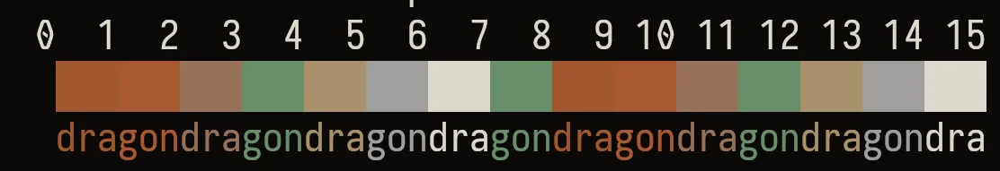

# Green Hills
## About
This repository holds ports of the theme Green Hills for terminal emulators.
That is a theme with a green and red palette.

Here is a preview of its palette:

## Palette
These are the colors used in the theme:

| Name                | ANSI | Hex Code  |
| ------------------- | ---- | --------- |
| Black (background)  | 0    | `#0b0807` |
| Red                 | 1    | `#a0572f` |
| Green               | 2    | `#a95831` |
| Yellow              | 3    | `#977259` |
| Blue                | 4    | `#688e68` |
| Magenta             | 5    | `#a8916b` |
| Cyan                | 6    | `#a1a09d` |
| White (foreground)  | 7    | `#dcd8ce` |

### Support
Report issues, questions and suggestions through its [issues page](https://github.com/skippyr/green-hills/issues).

## Copyright
This software is under the BSD-3-Clause license. A copy of the license is
bundled with the source code.
